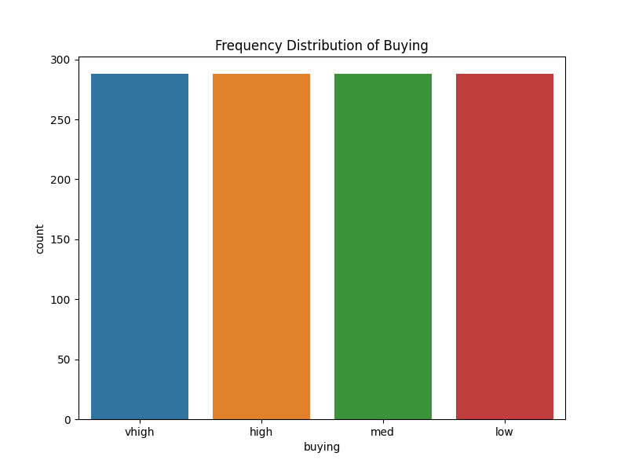
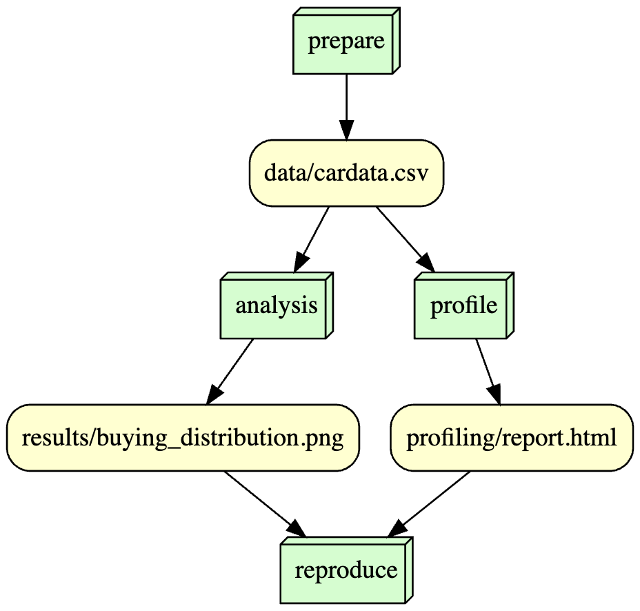

## IS477: Car Evaluation Analysis

## Overview
The Car Evaluation dataset is obtained from UC Irvine Machine Learning Repository. The Car Evaluation Database provides a set of instances evaluating cars based on attributes such as buying price, maintenance cost, number of doors, passenger capacity, luggage space, and safety, aimed at determining car acceptability. The dataset contains categorical features including buying price, maintenance cost, number of doors, passenger capacity, luggage boot size, and estimated car safety, each without missing values. The target variable 'class' categorizes the car's evaluation level, ranging from unacceptable to very good.

We aimed to analyze the range of buying values in this dataset, and from our visualization (buying_distribution.png), we found that there seems to be an almost equal (around 280) frequency of buying prices in the four categories, vhigh, high, med and low. 

## Contributions
Aarthi Shivkumar worked on prepare_data.py and analysis.py. Mahir Thakkar worked on dag.py and profile.py. Both of us worked on the Snakefile, requirements.txt and README.md edits together.

## Analysis
 
Our objective was to examine the distribution of buying values within the dataset. Utilizing a visualization named 'buying_distribution.png', we observed that the frequency of buying prices across the four categories - very high, high, medium, and low - appears to be strikingly similar, with each category having approximately 280 instances. This balanced distribution indicates a roughly equal representation of each buying price category in our data, providing a comprehensive view of different pricing tiers.

## Workflow

 

## Reproducing

1. Information about the environment: 
   - macOS Version: 13.5.1
   - Python Version: 3.9.6
   - BuildVersion: 22G90

2. Installing the Dependencies:
   - Install the following required Python packages:
   pip install -r requirements.txt

3. Running Script:
   - Execute the scripts in order:

     python scripts/prepare_data.py

     python scripts/profile.py

     python scripts/analysis.py
     
     python scripts/dag.py

With these steps, you have set up the environment and run the script successfully. 

## License
Software License: MIT License as it is open source, and freely available. This allows for anyone to utilize one's data and still give credit to the contributer.
Data License: Creative Commons Attribution 4.0 License, the CC-BY-4.0. License as it permits redistribution, sharing and use of data and content while giving appropritate credit.

## References
Bohanec, M. (1997). Car Evaluation. UCI Machine Learning Repository. https://doi.org/10.24432/C5JP48.
